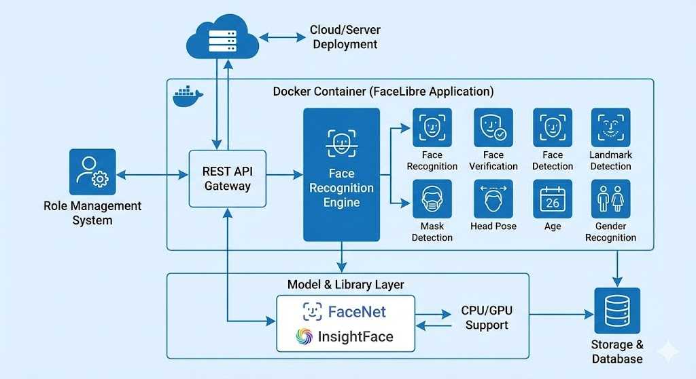
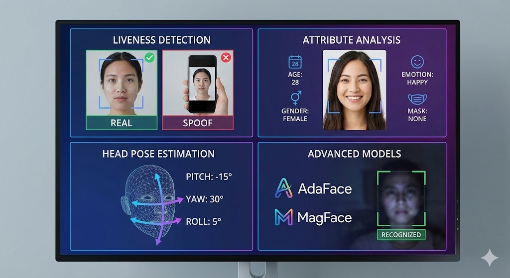

# FaceLibre - High Performance Face Recognition API



**FaceLibre** is an open-source, high-performance REST API for face recognition, verification, and detection. Built with **C++**, **Drogon**, and **OpenCV**, it is designed to be a drop-in high-efficiency replacement for other face recognition services (compatible with FaceLibre API standards).

## 🚀 Key Features

*   **High Performance**: Leveraging C++ and Drogon async web framework for maximum throughput and low latency.
*   **FaceLibre Compatibility**: Fully compatible with Exadel FaceLibre API (v1), allowing easy migration.
*   **Multiple Backends**:
    *   **File-based**: Simple, zero-dependency setup for small deployments.
    *   **MySQL**: Robust storage for production environments.
*   **State-of-the-Art Models**: Powered by OpenCV Zoo models (YuNet for detection, SFace for recognition) and expandable to InsightFace/FaceNet.
*   **Microservices Ready**: Designed to run in Docker containers as part of a larger architecture.

## 🛠 Technology Stack

*   **Language**: C++17
*   **Web Framework**: [Drogon](https://github.com/drogonframework/drogon)
*   **Computer Vision**: [OpenCV](https://opencv.org/) (DNN Module)
*   **Database**: MySQL / File System
*   **Formats**: ONNX (Model interactions)

## 📦 Installation & Build

### Prerequisites
*   Linux (Ubuntu 20.04/22.04 recommended)
*   CMake >= 3.10
*   G++ / Clang
*   OpenCV >= 4.5
*   Drogon Framework
*   MySQL Client (optional)

### Build Steps

```bash
# Clone the repository
git clone https://github.com/cvedix/FaceLibre.git
cd FaceLibre

# Create build directory
mkdir build && cd build

# Configure and Build
cmake ..
make -j$(nproc)
```

## 🚦 Usage

Start the server:

```bash
./face_api_server
# Or with specific options:
./face_api_server --mysql --mysql-host=127.0.0.1 --mysql-pass=secret
```

The server listens on port `8080` by default.

### API Cheatsheet

| Method | Endpoint | Description |
| :--- | :--- | :--- |
| `POST` | `/api/v1/recognition/faces` | Register a new face subject |
| `GET` | `/api/v1/recognition/faces` | List all registered faces |
| `POST` | `/api/v1/recognition/recognize` | Recognize faces + save to history |
| `POST` | `/api/v1/detection/search` | Search faces with date/threshold filters |
| `DELETE` | `/api/v1/recognition/faces` | Delete all or specific subject faces |
| `PUT` | `/api/v1/recognition/subjects/{name}` | Rename a subject |
| `GET` | `/api/health` | Service health status |

📖 **[Full API Documentation](docs/API.md)** - Complete endpoint reference with examples

Visit `http://localhost:8080/` in your browser for the interactive documentation.

## 🔮 Roadmap: Enhanced AI & Generative AI

We are actively working on the next generation of features to push the boundaries of open-source face analysis:

### 🧠 Enhanced AI (Analytical)

- [ ] **Liveness Detection**: Anti-spoofing techniques to distinguish real faces from photos/screens.
- [ ] **Attribute Analysis**: Integration of models for Age, Gender, Emotion, and Mask detection.
- [ ] **Head Pose Estimation**: Accurate 3D head pose tracking (Pitch, Yaw, Roll).
- [ ] **Advanced Models**: Support for AdaFace and MagFace for better recognition in challenging conditions.

### 🎨 Generative AI (Creative & Synthetic)

- [ ] **Synthetic Data Generation**: Using Gan/Diffusion models to create synthetic face variations for robust training/registration.
- [ ] **Face Anonymization**: Smart privacy filters to replace identities while preserving attributes (age, gender, expression) using generative networks.
- [ ] **Text-to-Face Search**: Semantic search capability to find faces based on textual descriptions (e.g., "man with glasses and beard").
- [ ] **Face Swapping**: Ethical face swapping module for privacy or entertainment use cases.

## 📄 License

This project is licensed under the **MIT License** - see the [LICENSE](LICENSE) file for details.

---

**Contributions are welcome!** Please read our contribution guidelines before submitting a pull request.
